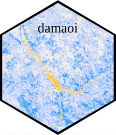

<!-- README.md is generated from README.Rmd. Please edit that file -->

# damaoi 

```{r, include = FALSE}
knitr::opts_chunk$set(
  collapse = TRUE,
  comment = "#>",
  fig.path = "man/figures/README-",
  out.width = "100%"
)
```

<!-- badges: start -->
<!-- badges: end -->

The goal of *damaoi* is to facilitate the comparative analysis of the social and environmental impacts of dam construction.
To date, impact evaluations use different methods to understand where exactly has been impacted by a dam, whether this be downstream, upstream, inundated areas, or areas bordering reservoirs.
We synthesis existing approaches to create a new methodological framework which allows for consistent comparative analysis.

Some people measure impacts at a basin scale. River basins are the 

You can install the latest version of damaoi from CRAN with:

``` r
install.packages("damaoi")
```

The software relies on openly available spatial data, specifically:

* The polygon of reservoirs created by dams. These are taken from the [Global Reservoir and Dams (GRanD) dataset](https://sedac.ciesin.columbia.edu/data/collection/grand-v1/methods).
* The polygons of river basins derived by [HydroBASINS](https://www.hydrosheds.org/products/hydrobasins).
* Elevation and accumulated river flow data derived from [HydroSHEDS](https://www.hydrosheds.org/hydrosheds-core-downloads).
* Surface water extent data from the [European Space Agency (ESA) Climate Change Initiative (CCI)](https://www.esa-landcover-cci.org/?q=node/162).

There are four stages to the process of creating an impacted area.

1) Standardising the reservoir polygon;
2) Building upstream and downstream lines to track rivers;
3) Creating buffer zones around the reservoir and river lines;
4) Clipping the buffer zones to river basins.

This readme will demonstrate this for one dam: Tehri in Uttarakhand, India.

## Adjust reservoir polygon to match water bodies

One normally gets the polygons of dam reservoirs from the excellent GRanD database.
However, some polygons are inconsistent with true water extent of reservoirs.
This is because of inconsistencies in the time of year that reservoir extents are measured.
The first step is to *adjust* the polygon to match water cover of one consistent source.
We suggest the CCI Global Water Bodies dataset, for larger dams the 300m^2^ resolution is sufficient, and the globally consistent algorithm is key.

```{r s1}
library(devtools)
load_all()
tehri_cci <- rast(system.file("extdata", "wb_tehri.tif", package="damaoi"))
tehri_grand <- damaoi::tehri
plot(tehri_cci)
plot(tehri_grand, add = T)

```

Here, the dam is the most southerly point.
To the east, there was a joining valley which was also inundated by water following the dam.
The first function takes two arguments, the grand polygon and the reference surface water dataset, and 'corrects' the polygon.

```{r s1_corrected}
tehri_dem <- rast(system.file("extdata", "dem_tehri.tif", package="damaoi"))
corrected <- adjustreservoirpolygon(reservoir = tehri_grand, water_bodies = tehri_cci, dem = tehri_dem)
par(mfrow = c(1,2))
plot(st_geometry(tehri_grand), main = "Original", xlim = st_bbox(corrected)[c(1, 3)], ylim = st_bbox(corrected)[c(2, 4)])
plot(st_geometry(corrected), main = "Corrected")
```

This gives a truer sense of the inundated land following the reservoir.

## Draw upstream and downstream lines

Rivers are complex to represent graphically.
The second stage of the process it to draw a line to follow the river downstream/upstream of the dam.
Those interested in understanding downstream/upstream impacts can use these areas.
To do this we use elevation data.
We recommend this source, but any elevation data in the correct format will work.

We also use flow accumulation data.
This requires HydroSheds data which measure the aggregated number of cells (in this case ~450m grid cells) that have formed a river to that point.
So if a river was 200 cells long, and was joined by another 300 cells long, the flow accumulation one cell downstream of the confluence would be 501.

``` {r s2_fac_demo}

tehri_fac <- rast(system.file("extdata", "fac_tehri.tif", package="damaoi"))
plot(tehri_fac)
plot(st_geometry(corrected), add = T)
```

This shows accumulated flow around the Tehri area.
For reference, at the end of the Ganges, the ultimate destination for water downstream of Tehri, the accumulated flow is 8.24 million.

For the downstream river line the algorithm begins at the point in the reservoir with the highest accumulation.
It searches nearby grid cells which are 'water'.
And selects the nearest point with a higher accumulation and a lower elevation.
This is an iterative process, for as far downstream as the user wishes to consider.
For us, the default is 100km downstream.

For the upstream river line the algorithm begins at the point in the reservoir with the lowest accumulation.
It searches nearby points which have water of a similar accumulation (to eliminate the river being diverted to insignificant upstream springs).
And selects the nearest point with a lower accumulation and a higher elevation, again to 100km.

``` {r s2}

```

