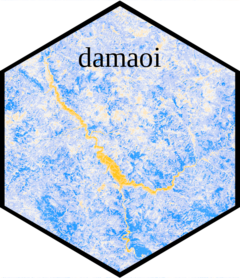
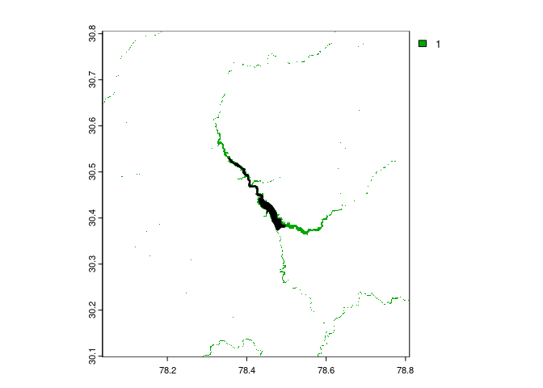
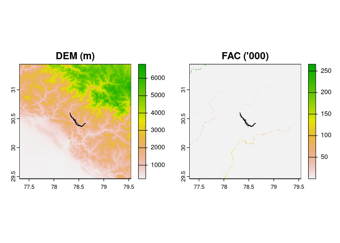

<!-- README.md is generated from README.Rmd. Please edit that file -->

# damaoi 

<!-- badges: start -->
<!-- badges: end -->

This package creates an ‘area of interest’ around a constructed dam.
Dams have environmental and social impacts, both positive and negative.
Impact evaluations today have no consistent way of specifying exactly
where has been impacted by dams, so impacts are measured inconsistently.
This hinders our ability to compare where dams have had a higher or
lower impact, and our ability to make informed infrastructure
investments. Reservoirs flood land upstream of the dam. Downstream river
flows are more regular and contain less sediment. Upstream fish
populations are lower. These cause changes in land use and land cover
around dams which can be measured using remote sensing or field data.
But when measuring impacts, how close to the reservoir should you
consider? How far downstream or upstream? How does the topography of the
landscape, or the confluences with other rivers, change these
considerations? This package facilitates adjusting reservoir polygons to
match satellite-observed surface water area, plotting upstream and
downstream rivers using elevation data and accumulated river flow, and
drawing buffers clipped by river basins to determine the areas which
could be impacted by dam construction. The package lets users create
areas of interest around a dam according to set principles. This is an
essential step before being able understand the comparative impact of
dams. And this knowledge key to making better infrastructure investment
decisions for future hydropower, irrigation and drinking water projects.

## Installation

You can install the latest version of damaoi from CRAN using:

``` r
install.packages("damaoi")
```

## Overview

The software relies on openly available spatial data, specifically:

- The polygon of reservoirs created by dams. These are taken from the
  [Global Reservoir and Dams (GRanD)
  dataset](https://sedac.ciesin.columbia.edu/data/collection/grand-v1/methods).
- The polygons of river basins derived by
  [HydroBASINS](https://www.hydrosheds.org/products/hydrobasins).
- Elevation and accumulated river flow data derived from
  [HydroSHEDS](https://www.hydrosheds.org/hydrosheds-core-downloads).
- Surface water extent data from the [European Space Agency (ESA)
  Climate Change Initiative
  (CCI)](https://www.esa-landcover-cci.org/?q=node/162).

There are three stages to the process of creating an impacted area.

1)  Standardising the reservoir polygon;
2)  Building upstream and downstream lines to track rivers;
3)  Creating buffer zones around the reservoir and river lines, taking
    into account river basins.

This will demonstrate this for one dam: Tehri in Uttarakhand, India.

### Stage 1: adjust reservoir polygon to match water bodies

One normally gets the polygons of dam reservoirs from the excellent
GRanD database. However, some polygons are inconsistent with true water
extent of reservoirs. This is largely because of inconsistencies in the
time of year that reservoir extents are measured. The first step is to
*adjust* the polygon to match water cover of one consistent source. We
suggest the CCI Global Water Bodies dataset, for larger dams the
300m<sup>2</sup> resolution is sufficient, and the globally consistent
algorithm is key.

``` r
library(devtools)
#> Loading required package: usethis
load_all()
#> ℹ Loading damaoi
tehri_cci <- rast(system.file("extdata", "wb_tehri.tif", package="damaoi"))
tehri_grand <- damaoi::tehri
plot(tehri_cci)
plot(tehri_grand, col = "black", add = T)
```



Here, the dam is the most southerly point. To the east, there was a
joining valley which was also inundated by water following the dam. The
first function takes two arguments, the grand polygon and the reference
surface water dataset, and ‘corrects’ the polygon.

``` r
tehri_dem <- rast(system.file("extdata", "dem_tehri.tif", package="damaoi"))
tehri_adjusted <- adjustreservoirpolygon(reservoir = tehri_grand, water_bodies = tehri_cci, dem = tehri_dem)
par(mfrow = c(1,2))
plot(st_geometry(tehri_grand), main = "Original", xlim = st_bbox(tehri_adjusted)[c(1, 3)], ylim = st_bbox(tehri_adjusted)[c(2, 4)])
plot(st_geometry(tehri_adjusted), main = "Adjusted")
```


This gives a truer sense of the inundated land following the reservoir.

## Stage 2: find upstream and downstream lines

The second stage of the process it to draw a line to follow the river
downstream/upstream of the dam. Those interested in understanding
downstream/upstream impacts can use the rivers, represented digitally as
LINESTRINGS, to inform their impact evaluations. To map the river paths
digitally, we build an algorithm using Digital Elevation Model (DEM)
data and Flow ACumulation data (FAC). We recommend using HydroSHEDS 15s
data.

DEM measures the average elevation in each grid cell. FAC values are
unitless, and simply measure the aggregated number of cells (in this
case ~450m grid cells) that have accumulated to form the river at each
cell. So if a river was 200 cells long, and was joined by another 300
cells long, the flow accumulation one cell downstream of the confluence
would be 501.

``` r

tehri_fac <- rast(system.file("extdata", "fac_tehri.tif", package="damaoi"))
par(mfrow = c(1,2))
plot(tehri_dem, main = "DEM (m)")
plot(st_geometry(tehri_adjusted), add = T)
plot(tehri_fac/1000, main = "FAC ('000)")
plot(st_geometry(tehri_adjusted), add = T)
```



This shows the DEM and the FAC around Tehri dam. For reference, at the
end of the Ganges, the ultimate destination for water downstream of
Tehri, the accumulated flow is 8.24 million.

For the downstream river line the algorithm begins at the point in the
reservoir with the highest accumulation. It searches nearby grid cells
which are ‘water’. And selects the nearest point with a higher
accumulation and a lower elevation. This is an iterative process, for as
far downstream as the user wishes to consider. For us, the default is
100km downstream.

For the upstream river line the algorithm begins at the point in the
reservoir with the lowest accumulation. It searches nearby points which
have water of a similar accumulation (to eliminate the river being
diverted to insignificant upstream springs). And selects the nearest
point with a lower accumulation and a higher elevation, again to 100km.

``` r

# warning for long runtime! 

upriver <- getriverpoints(reservoir = tehri_adjusted, direction = "upstream", river_distance =100000, ac_tolerance = 2, e_tolerance = 5, nn = 100, fac = tehri_fac, dem = tehri_dem)
downriver <- getriverpoints(reservoir = tehri_adjusted, direction = "downstream", river_distance =100000, ac_tolerance = 2, e_tolerance = 5, nn = 100, fac = tehri_fac, dem = tehri_dem)
plot(st_geometry(tehri_adjusted), col = "black", xlim = c(78,79), ylim = c(30,31), main = "River lines")
plot(upriver[[2]], add = T, col = "darkgreen")
plot(downriver[[2]], add = T, col = "red")
plot(tehri_dem, add = T, alpha = 0.5, main = "River lines", legend = F, xlim = c(78,79), ylim = c(30,31))
```


Upstream is shown by the blue line, travelling 100km north then east
from the reservoir into the high Himalaya. Downstream is shown by the
red line travelling south from the reservoir towards Devprayag. The red
line is shorter than the blue line, because the river meets a confluence
where the Brahmaputra meets the Alakhnanda to form the Ganges. This is a
termination point for the algorithm, because any downstream effects
further than this are a result of changes to bother river systems, and
cannot be isolated to be caused by Tehri dam. The river distances and
the acceptable increase in river flow accumulation due to confluences
are set by the user of this tool.

### Stage 3: draw buffers around reservoir and river lines, and clip to river basins

After we have drawn the river lines, we need to create a zone around the
rivers and reservoir, representing how far around the rivers (and
reservoir) we consider having been potentially impacted by the dam. This
is in many parts a subjective choice, faced by anyone conducting spatial
analysis. In our view there are a range of acceptable decisions, and
some will be more appropriate in certain contexts than others. For
comparative analysis, however, the important factor is consistency. For
the impacts of one dam to be compared against the impacts of a different
dam, the buffer zones need to be equivalent. We set default buffers are
2km around rivers, and 5km around reservoirs. River basins are
determined by the topography. If rain falls on a mountain with two
slopes, an east and a west aspect, either side of a knife-edge ridge,
the water will accumulate into two separate river systems. If a buffer
from a river in the east system strays into the west system, we will
pick up changes which have very little to do with the construction of
the dam. For this reason, we clip the buffers to the basins which
intersect with the areas of the rivers and reservoir.

``` r
tehri_basins <- damaoi::basins_tehri
impacted_area <- basinandbuffers(tehri_adjusted, upriver[[2]], downriver[[2]], tehri_basins, 2000,5000)
plot(st_union(impacted_area[[1]]), col = "yellow", xlim = c(78,79), ylim = c(30,31), main = "Buffer and clip to basin areas")
plot(st_union(impacted_area[[2]]), add = T, col = "skyblue", xlim = c(78,79), ylim = c(30,31))
plot(tehri_basins[st_buffer(impacted_area[[1]], 10000),], xlim = c(78,79), ylim = c(30,31), col = NA, add =T, alpha = 0.3, border = "darkgrey")
plot(st_geometry(tehri_adjusted), col = "black", xlim = c(78,79), ylim = c(30,31), main = "River lines", add = T)
plot(upriver[[2]], add = T, col = "black")
plot(downriver[[2]], add = T, col = "black")
```


This shows the buffer zone in yellow, overlaid by the clipped buffer
zone in blue. The borders of river basins are shown in dark grey, and
the reservoir and rivers are in black. Any impacts in yellow areas, due
to elevated land seperating these areas from blue areas, are not
impacted by the reservoir or changes in the river following dam
construction.
